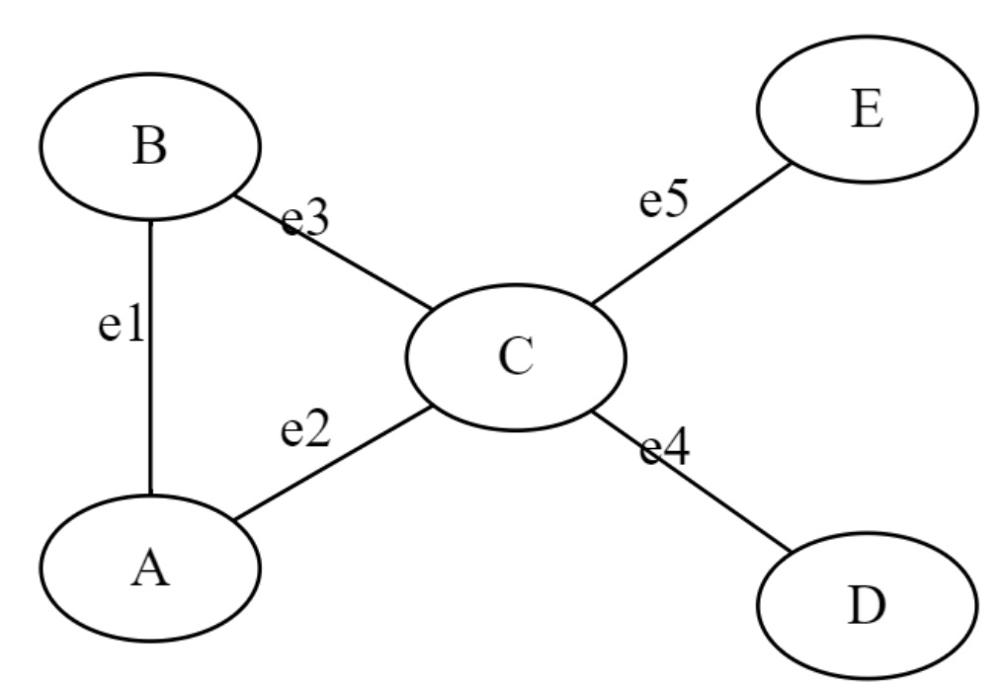
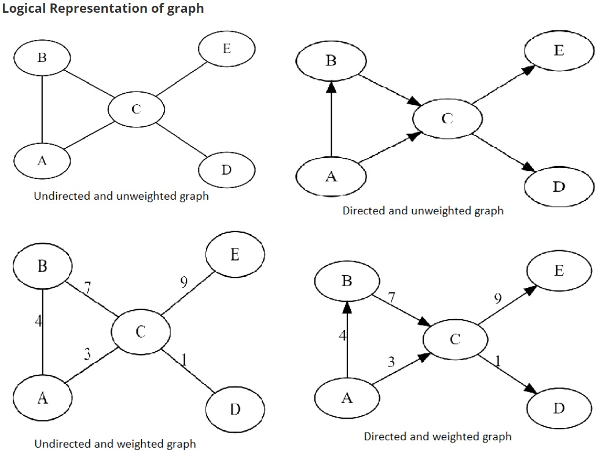

# Introduction to Graphs

Prof Madhavan Mukund, Chennai Mathematical Institute.

Lecture source : <https://pdsaiitm.github.io/week-4/summary.html>

**Graph**:- It is a non-linear data structure. A graph G consist of a non empty set V where members are called the vertices of graph and the set E where member are called the edges.

G = (V, E)

V = set of vertices

E = set of edges 

Above graph can be written on paper as:

G = (V, E)

V = {A,B,C,D,E}

E = {e1,e2,e3,e4,e5} or {(A,B), (A,C), (B,C), (C,D), (C,E)}

## Basic Terminology of Graph

**Vertex (or node):**
A vertex or node is a fundamental unit in a graph. In a simple graph, each vertex can be connected to other vertices by edges. Vertices are often represented by circles or dots in visual representations of graphs.

 
**Edge:**

An edge is a line or connection between two vertices in a graph. Edges can be directed or undirected, and weighted or unweighted. In an undirected graph, edges connect vertices without a specified direction, while in a directed graph, edges have a direction, represented by an arrow. In a weighted graph, edges have a numerical weight or value assigned to them.

**Degree:** 

The degree of a vertex is the number of edges that are connected to it. In a directed graph, the degree of a vertex is defined as the sum of the **in-degree** (number of edges coming into the vertex) and **out-degree** (number of edges going out of the vertex).

 

**Path:** 

A path is a sequence of vertices connected by edges. A simple path is a path where no vertex is repeated.

 

**Cycle:** 

A cycle is a path that starts and ends at the same vertex.

 

**Connectedness:** 

A graph is said to be connected if there is a path between any two vertices in the graph. A disconnected graph is a graph that is not connected, meaning it can be broken into two or more separate components.

 

**Component:** 

A component is a connected subgraph of a larger graph. In other words, it is a part of the graph that is connected to other vertices or edges within that part, but not connected to the rest of the graph.

 

**Directed graph:** 

A directed graph is a graph where edges have a direction, represented by an arrow. In a directed graph, edges are often called arcs.

 

**Undirected graph:** 

An undirected graph is a graph where edges do not have a direction.

 

**Weighted graph:** 

A weighted graph is a graph where edges have weights or values assigned to them.

 

**Adjacent vertices:** 

Two vertices are adjacent if they are connected by an edge.

 

**Incidence:** 

A vertex is incident on an edge if the vertex is one of the endpoints of the edge.

 

**Subgraph:** 

A subgraph is a graph that is a subset of another graph, with some edges and vertices removed.

 

**Complete graph:** 

A complete graph is a graph where every vertex is connected to every other vertex. In other words, there is an edge between every pair of vertices in the graph.

## Logical representation of Graphs

One can draw different types of Graphs:

